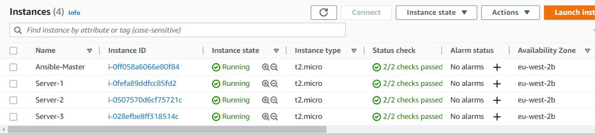
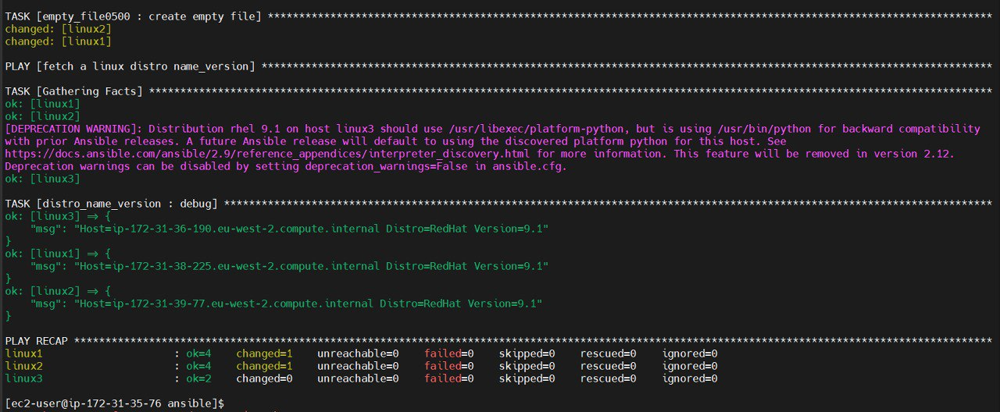

# Task5-Ansible

## To complete the task, I created:
### 4 linux machines (AWS EC2) with python3.7 installed;

## Solution
* Install Ansible on Ansible-Master server;
* Create an inventory file with four groups (as specified in the task) ===>>> ***[inventory file](hosts.txt)***
* Connect to managed servers;
* Create Role: creating a empty file /etc/iaac with rigths 0500 ===>>> ***[role for empty file](roles/empty_file0500/tasks/)***
* Create Role: fetch a linux distro name and version. ===>>> ***[role for disrto name version](roles/distro_name_version/tasks/)***
* Create PlayBook with both Roles ===>>> ***[Playbook](playbook_1.yml)***

To run Playbook use : ansible-playbook playbook_1.yml

### Thank you!
